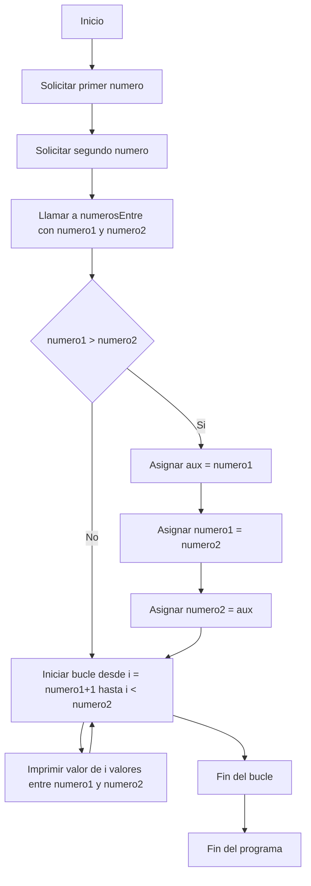
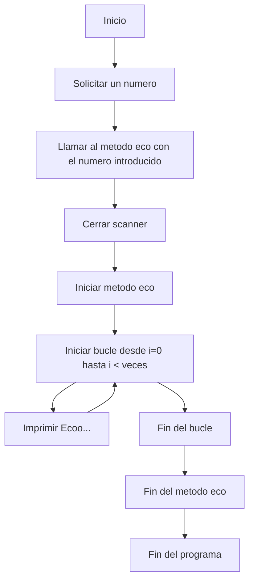
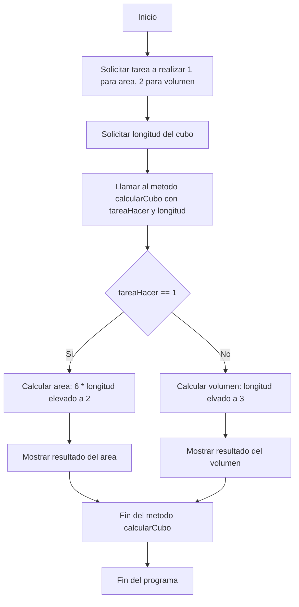
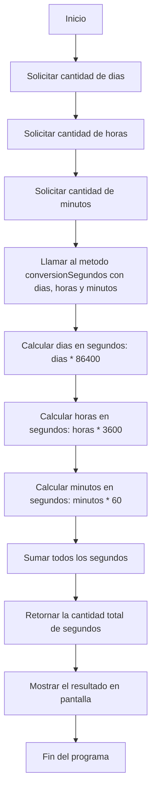
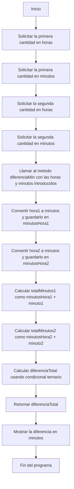
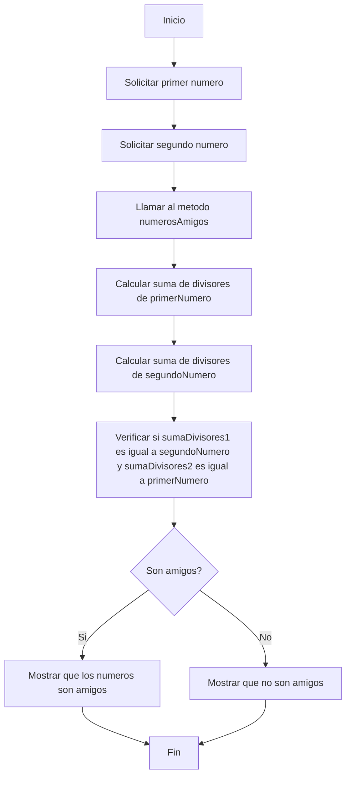

# Ejercicios del Boletin 6
## Ejercicio 1
Nos permite mediante un metodo saber la cantidad de numeros entre un numero y otro

## Ejercicio 2
Nos imprime la palabra Eco... un numero n de veces

## Ejercicio 3
Nos solicita un caso 1 para area y 2 para volumen y la longitud y luego nos muestra area o volumen

## Ejercicio 4
Introduciendo una cantidad en dias otra en horas y otra en minutos obtenemos
la cantidad total de segundos

## Ejercicio 5
Nos muestra la diferencia en minutos de dos intervalos de tiempo en horas y minutos

## Ejercicio 6
Nos muestra si dos numeros son Amigos esto ocurre cuando la suma de los divisores de un numero es igual al otro numero y viceversa

Esto es una prueba de concepto de diagrama de flujo en Mermaid usando ChatGPT