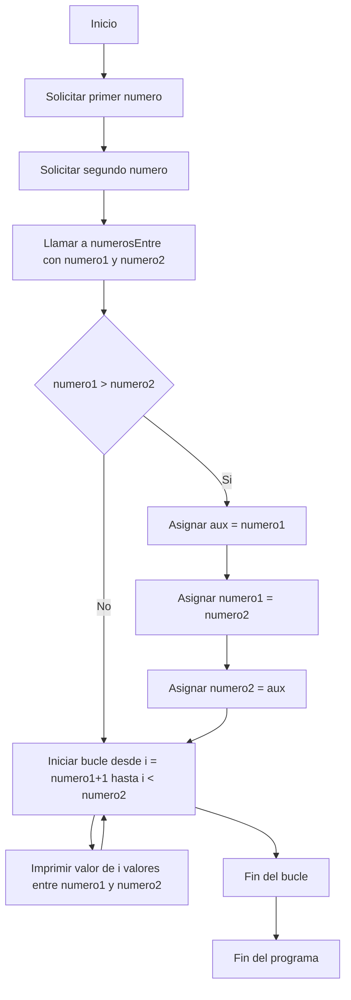
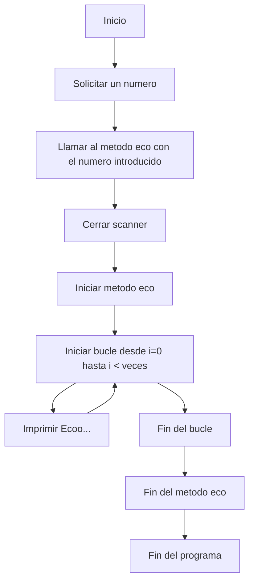
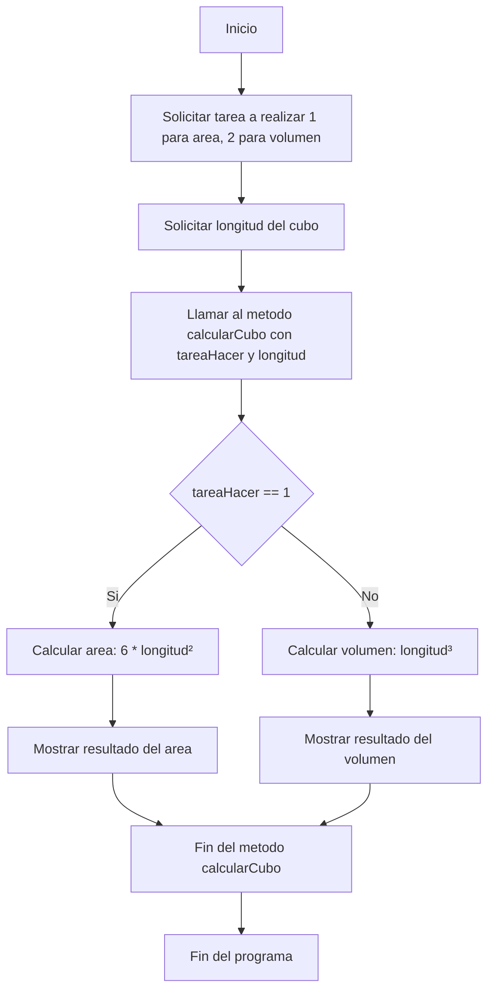

# Ejercicios del Boletin 6
## Ejercicio 1
Nos permite mediante un metodo saber la cantidad de numeros entre un numero y otro

## Ejercicio 2
Nos imprime la palabra Eco... un numero n de veces

## Ejercicio 3
Nos solicita un caso 1 para area y 2 para volumen y la longitud y luego nos muestra area o volumen

