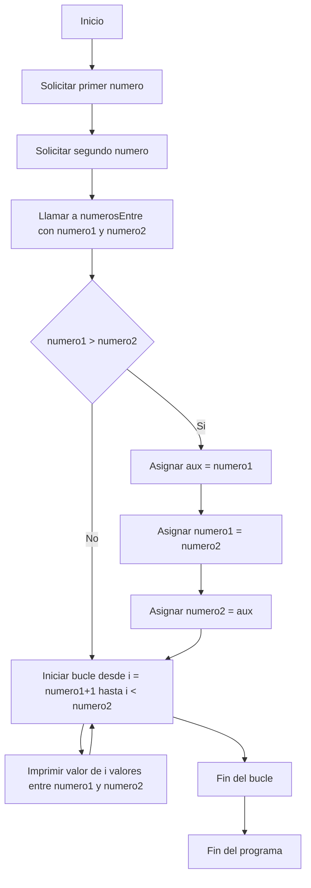

# Ejercicios del Boletin 6
## Ejercicio 1
Nos permite mediante un metodo saber la cantidad de numeros entre un numero y otro

```mermaid
graph TD
    A[Inicio] --> B[Solicitar primer numero]
    B --> C[Solicitar segundo numero]
    C --> D[Llamar a numerosEntre con numero1 y numero2]
    D --> E{numero1 > numero2}
    E -->|Si| F[Asignar aux = numero1]
    F --> G[Asignar numero1 = numero2]
    G --> H[Asignar numero2 = aux]
    E -->|No| I[Iniciar bucle desde i = numero1+1 hasta i < numero2]
    H --> I
    I --> J[Imprimir valor de i valores entre numero1 y numero2]
    J --> I
    I --> K[Fin del bucle]
    K --> L[Fin del programa]

```